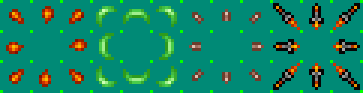
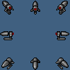
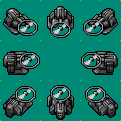
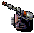
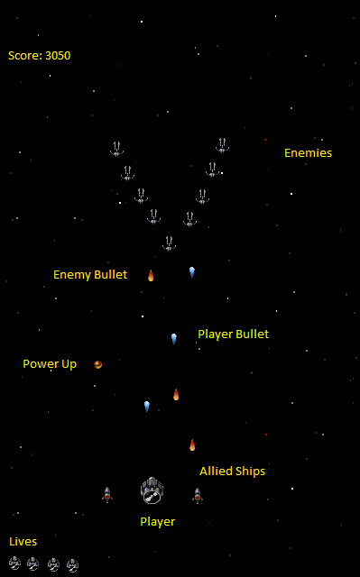

# Bullet Hell
My game will be an infinite Bullet Hell (also known as top down shooters) that will randomly spawn formations of enemies for the player to kill or avoid.

----

## Moving Things
This Bullet Hell will have 5 or more seperate moving things (not including the player).

| Object        | Function                                                                                                         |
| --------------| ----------------------------------------------------------------------------------------------------------------:|
| Enemy Bullet  | Destroys Player upon collision 										   |
| Player Bullet | Destroys Enemies upon collision 										   |
| Enemy Ships   | Destroys Player upon collision and fires Enemy Bullets. Randomly Spawns |
| Power-Ups     | Gives the Player allies											   |
| Allies        | Appears next to the player and fires at Enemies							   |
| Artillery     | Does not destroy Player nor is it destroyable(as it is on the "ground". Randomly Spawns on the right side of the screen; shoots Artiller Shells at a random rate towards the left    |
| Artillery Shell    | Spawns from a cannon. Destroys Player upon Collision |

#### Enemy Bullet

#### Player Bullet

#### Enemy Ship

#### Power-ups

#### Allies

#### Player

#### Artillery

#### Artillery Shell

## Control Scheme
The Player will be able to control the ship through the keyboard.

Left, Right, Up, and Down will move the ship in the four directions and Space Bar will fire the bullets.

Pressing escape during the game will pause the game.

## Scoring
The score will not go down. Rather, the score will constantly increase depending on how long you have stayed alive. Not only that, killing enemies will award bonus points as to provide an incentive to tackle the enemies rather than just avoiding them.

## Lives
I will keep track of the players lives on the top right hand corner. The will start off with three lives. Getting hit by an enemy bullet will take away a life, clear the screen of all enemies, and revive you.

The game ends when you lose all of your lives.

## Layout

This is the Game Layout

