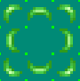
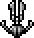
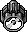
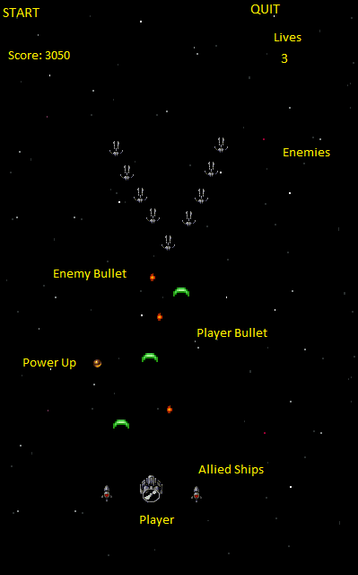

# Bullet Hell
My game will be an infinite Bullet Hell (also known as top down shooters) that will randomly spawn formations of enemies for the player to kill or avoid.

----

## Moving Things
This Bullet Hell will have 5 or more seperate moving things (not including the player).

| Object        | Function                                                                                                         |
| --------------| ----------------------------------------------------------------------------------------------------------------:|
| Enemy Bullet  | Destroys Player upon collision 										   |
| Player Bullet | Destroys Enemies upon collision 										   |
| Enemy Ships   | Destroys Player upon collision and fires Enemy Bullets. Also moves in formation (randomly determined from a set) |
| Power-Ups     | Gives the Player allies, a bomb, or upgraded weapons 								   |
| Allies        | Temporarily appears next to the player and fires at Enemies							   |

#### Enemy Bullet

#### Player Bullet

#### Enemy Ship

#### Power-ups

#### Allies

#### Player

## Control Scheme
The Player will be able to control the ship through the keyboard.

Left, Right, Up, and Down will move the ship in the four directions and Space Bar will fire the bullets.
Pressing B will drop a bomb which will clear all the enemies on the screen.

## Scoring
The score will not go down. Rather, the score will constantly increase depending on how long you have stayed alive. Not only that, killing enemies will award bonus points as to provide an incentive to tackle the enemies rather than just avoiding them.

## Lives
I will keep track of the players lives on the bottom left hand corner. The will start off with five lives. Getting hit by an enemy bullet will take away a life, clear the screen of all enemies, and revive you.

The game ends when you lose all of your lives.

## Layout

